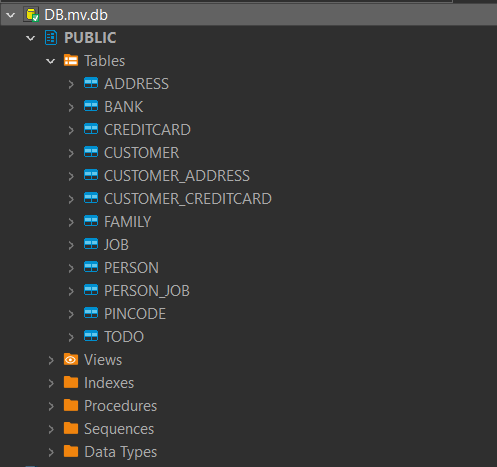
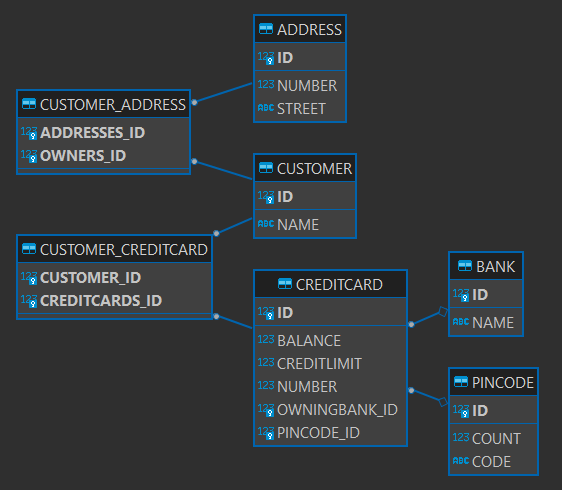

# DAT250: Assignment 2

The database is stored as a file `DB.mv.db`. H2 databases are in 
memory databases. The data is stored in memory when the program 
is running.


The sql used to create the Customer table:
```
    create table Customer (
        id bigint generated by default as identity,
        name varchar(255),
        primary key (id)
    )
```

The database:




In order to inspect the database I used DBeaver. I encountered a problem
with the version of the H2 database that was too new for the DBeaver. They
resiliently had some breaking changes. I had to use an older version in the 
`persistence.xml` file.