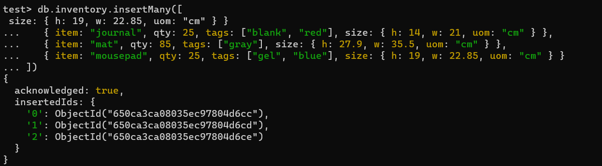
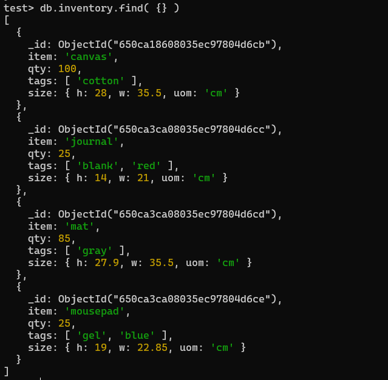
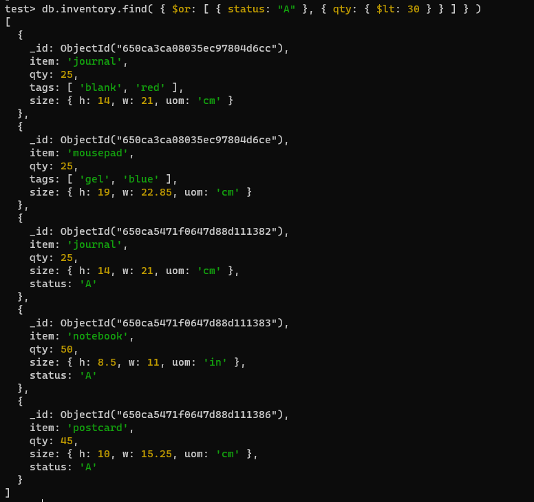
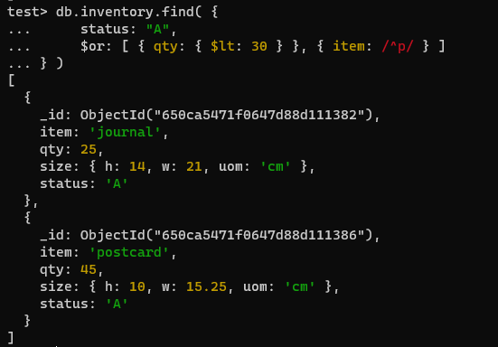
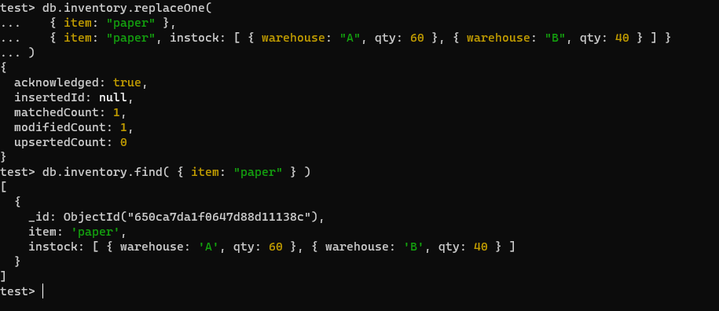
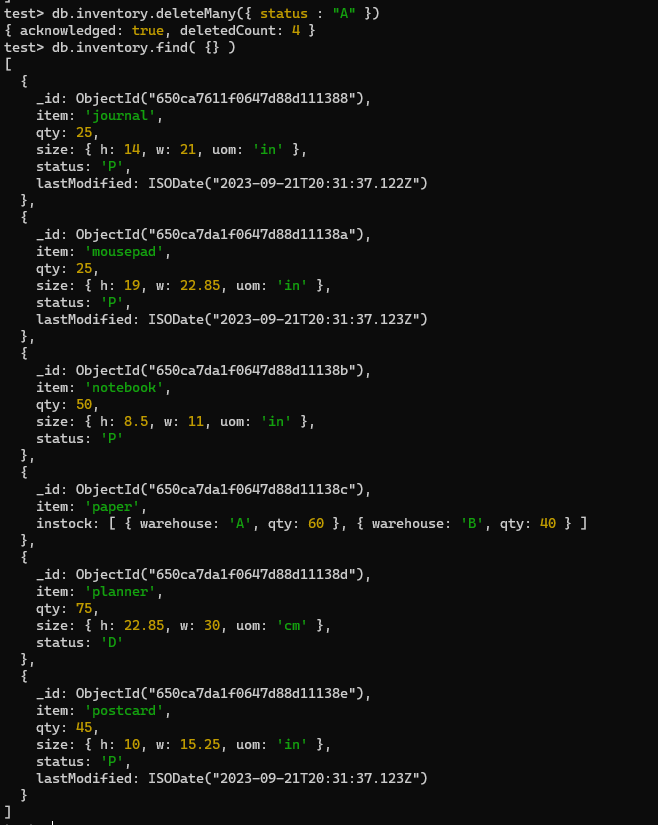
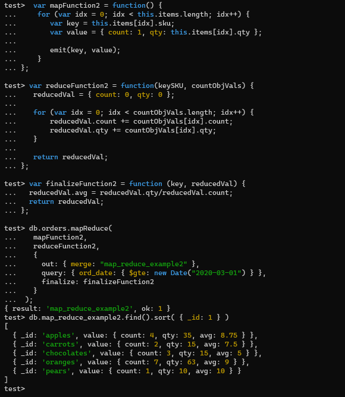
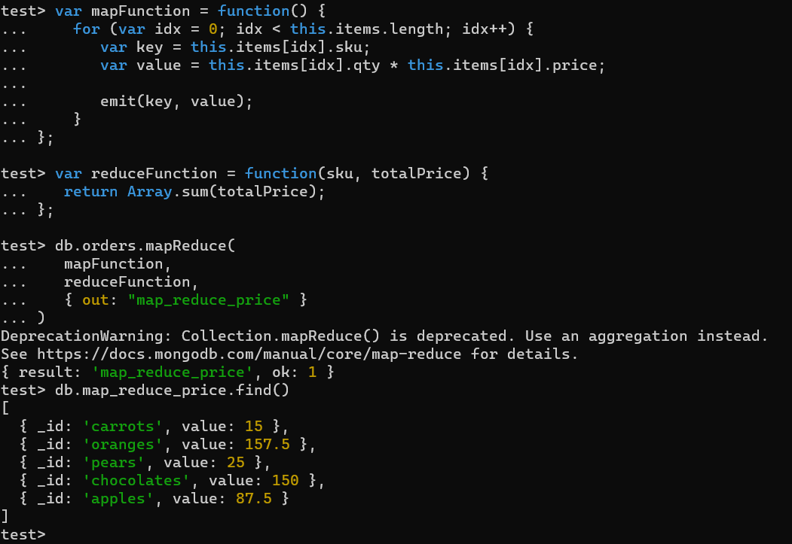

# DAT250: Experiment Assignment 3
Installation went fine.
## Exercise 1
### Insert

### Query

## Update

## Remove

## Exercise 2
Tutorial:

My own:

This map-reduce is useful for finding how much money that
have been spent on the different products. We can se that
most money is spent on oranges and chocolate. So if you own
a shop, you would know that these are bringing in the most
money.

